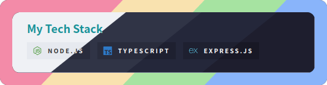
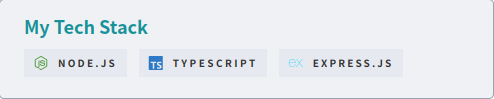

<h3 align="center">
	 
	
	Catppuccin for <a href="https://github.com/0l1v3rr/github-readme-tech-stack">GitHub Readme Tech Stack</a>
	
</h3>

	
	
	

	

## Previews

🌻 Latte

🪴 Frappé

🌺 Macchiato

🌿 Mocha

## Usage

1. Go to [GitHub Readme Tech Stack generator](https://github-readme-tech-stack.vercel.app/).
2. Select the theme to your favorite flavour. Catppuccin theme names start with `catppuccin_`.
3. Click "Generate" button to get the card URL!

## 💝 Thanks to

- [Konosuke Sakai](https://github.com/sakkke)

&nbsp;

	

	Copyright &copy; 2021-present <a href="https://github.com/catppuccin" target="_blank">Catppuccin Org</a>

	

